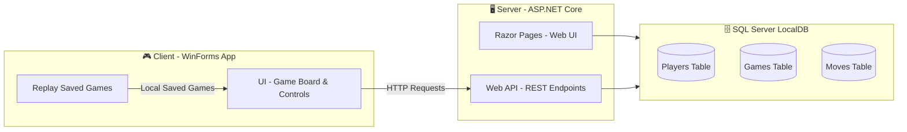

# 🎮 Connect Four – Client & Server Project

---

<h2> Overview</h2>
This project is an academic implementation of the classic **Connect Four** game with a **Client–Server architecture**.  

- **Client (WinForms)**: Provides a modern UI for playing Connect Four against the computer (server). Includes animations, replay functionality, and a Discord-inspired design theme.  
- **Server (ASP.NET Core)**: Manages the game logic, player registration, database, and queries. Supports multiple clients playing independently in parallel.  

The project demonstrates **full-stack development** in C#, combining a desktop application, ASP.NET Core Web App (Razor Pages), and ASP.NET Core Web API, along with SQL Server for persistent data storage.

---

## 📸 Screenshots

- Login Screen (Client)

- Game Board (Client)

- Replay List (Client)

- Replay Display (Client)

- Razor Pages - Home Screen (Server Dashboard)

- Razor Pages - ScoreBoard (Server Dashboard)

---

<h2> Features</h2>

- 🔹 Play **Connect Four** against the server.  
- 🔹 Player registration with validation (name, ID, phone, country).  
- 🔹 **Stylish WinForms Client** with Discord theme and animations.  
- 🔹 **Replay functionality** for past games saved locally.  
- 🔹 **Server Web Interface** (Razor Pages) for:
  - Registering players
  - Running queries
  - Viewing statistics & player information
  - Managing updates and deletions  
- 🔹 **REST API** (ASP.NET Core Web API) for client–server communication.  
- 🔹 **SQL Server Database**:
  - Stores players, games, and moves
  - Supports queries like:
    - All players (ordered case-sensitive)
    - All games with details
    - Distinct games without duplicates
    - Player statistics per country
    - Player participation counts  

---

<h2> Technologies Used</h2>

- **C# .NET**  
- **WinForms** (Client UI)  
- **ASP.NET Core Razor Pages** (Server web app)  
- **ASP.NET Core Web API** (Server API)  
- **SQL Server LocalDB** (ADO.NET / Entity Framework)  
- **LINQ** for queries  
- **Bootstrap** (styling Razor pages)

---

## 🏗 Architecture

<h2> Authors</h2>

<ul>
    <li><a href="https://github.com/YosiBs">Yosi Ben Shushan</a></li>
    <li><a href="https://github.com/Noam0">Noam Ben Benjamin</a></li>
</ul>

---

<h2> References</h2>

- [Connect Four inspiration game](https://www.cbc.ca/kids/games/all/connect-4)  
- [ASP.NET Core Razor Pages Documentation](https://learn.microsoft.com/en-us/aspnet/core/tutorials/razor-pages/page)  
- [ASP.NET Core Web API Documentation](https://learn.microsoft.com/en-us/aspnet/web-api/overview/advanced/calling-a-web-api-from-a-net-client)  
- [Bootstrap Grid System](https://getbootstrap.com/docs/5.0/layout/grid/)  

---

